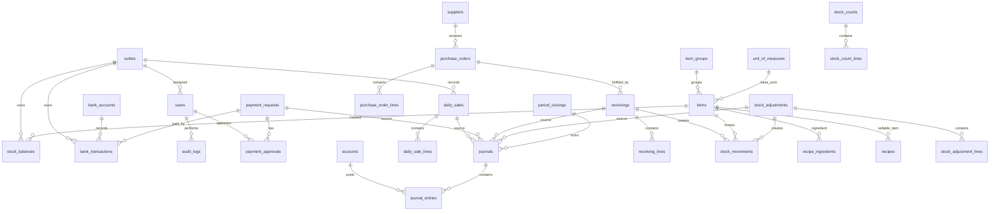

# ERD Sketch

This is a first-pass schema blueprint. Final implementation should be expressed in Laravel migrations.

## Core Tables

1. outlets
2. users
3. roles, permissions, role_user, permission_role
4. item_groups
5. unit_of_measures
6. items
7. suppliers
8. customers
9. accounts (COA)
10. bank_accounts
11. daily_sales, daily_sale_lines
12. payment_requests, payment_approvals
13. bank_transactions
14. purchase_orders, purchase_order_lines
15. receivings, receiving_lines
16. stock_balances, stock_movements
17. stock_counts, stock_count_lines
18. stock_adjustments, stock_adjustment_lines
19. recipes, recipe_ingredients
20. journals, journal_entries
21. period_closings
22. audit_logs
