# Sketsa ERD

Blueprint schema awal. Implementasi final harus ditulis sebagai Laravel migrations.

## Catatan Keputusan

1. Primary key default: `BIGINT` auto-increment.
2. Foreign key default: `foreignId`/`BIGINT` dengan suffix `_id`.
3. Uang: `DECIMAL(18,2)`.
4. Manufacturing table belum masuk MVP.
5. Central Kitchen adalah outlet/storage pada MVP.
6. Tabel `outlet_configs`, `posting_rules`, dan `audit_logs` wajib ada untuk menutup konfigurasi dan traceability.

```mermaid
erDiagram
    outlets ||--o{ users : assigned
    outlets ||--o{ outlet_configs : configures
    outlets ||--o{ daily_sales : records
    outlets ||--o{ stock_balances : owns
    outlets ||--o{ bank_transactions : owns

    users ||--o{ audit_logs : performs
    users ||--o{ payment_approvals : approves

    item_groups ||--o{ items : groups
    unit_of_measures ||--o{ items : base_uom
    suppliers ||--o{ purchase_orders : receives
    purchase_requests ||--o{ purchase_request_lines : contains
    purchase_requests ||--o{ purchase_orders : converts_to
    bank_accounts ||--o{ bank_transactions : records
    accounts ||--o{ accounts : parent
    accounts ||--o{ journal_entries : posts
    accounts ||--o{ posting_rules : maps

    daily_sales ||--o{ daily_sale_lines : contains
    daily_sales ||--o{ journals : source

    payment_requests ||--o{ payment_approvals : has
    payment_requests ||--o{ bank_transactions : paid_by
    payment_requests ||--o{ journals : source

    purchase_orders ||--o{ purchase_order_lines : contains
    purchase_orders ||--o{ receivings : fulfilled_by
    receivings ||--o{ receiving_lines : contains
    receivings ||--o{ stock_movements : creates
    receivings ||--o{ journals : source

    items ||--o{ stock_balances : tracked
    items ||--o{ stock_movements : moves
    items ||--o{ recipe_ingredients : ingredient
    items ||--o{ recipes : sellable_item
    items ||--o{ stock_usage_lines : consumed

    stock_usages ||--o{ stock_usage_lines : contains
    stock_usages ||--o{ stock_movements : creates
    stock_usages ||--o{ journals : source

    period_closings ||--o{ inventory_snapshots : freezes
    period_closings ||--o{ report_snapshots : freezes

    stock_counts ||--o{ stock_count_lines : contains
    stock_adjustments ||--o{ stock_adjustment_lines : contains
    stock_adjustments ||--o{ stock_movements : creates
    stock_adjustments ||--o{ journals : source

    journals ||--o{ journal_entries : contains
    period_closings ||--o{ journals : locks
```

## Tabel Inti MVP

1. outlets
2. outlet_configs
3. users
4. roles, permissions, role_user, permission_role
5. item_groups
6. unit_of_measures
7. items
8. suppliers
9. accounts (COA)
10. posting_rules
11. bank_accounts
12. daily_sales, daily_sale_lines
13. payment_requests, payment_approvals
14. bank_transactions
15. purchase_requests, purchase_request_lines
16. purchase_orders, purchase_order_lines
17. receivings, receiving_lines
18. stock_balances, stock_movements
19. stock_usages, stock_usage_lines
20. stock_counts, stock_count_lines
21. stock_adjustments, stock_adjustment_lines
22. recipes, recipe_ingredients
23. journals, journal_entries
24. period_closings
25. inventory_snapshots
26. report_snapshots
27. audit_logs

## Disiapkan untuk Fase 2

1. production_orders
2. raw_material_issues
3. finished_good_receipts
4. delivery_orders
5. internal_invoices
6. customers, customer_invoices, customer_receipts
