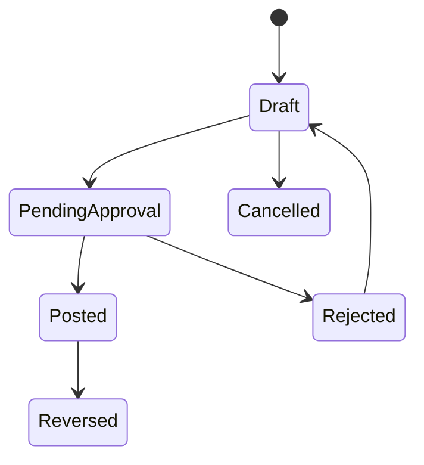

# State Machine: Manual Journal

## Transition Rules

| From | To | Actor | Rule |
|---|---|---|---|
| Draft | PendingApproval | Accounting | Total debit = total credit; setiap line hanya debit atau kredit |
| PendingApproval | Posted | Accounting lead / Owner | Creator tidak boleh approve sendiri; period open |
| PendingApproval | Rejected | Approver | Comment required |
| Posted | Reversed | Accounting lead | Reason required; reversal journal dibuat, original tidak diedit |

## Guards

1. Journal wajib balance sebelum boleh submit.
2. Creator ≠ approver.
3. Posting diblokir bila `journal_date` dalam closed period.
4. Posted journal immutable — koreksi hanya lewat reversal.
5. Semua transisi masuk audit log (before/after).
