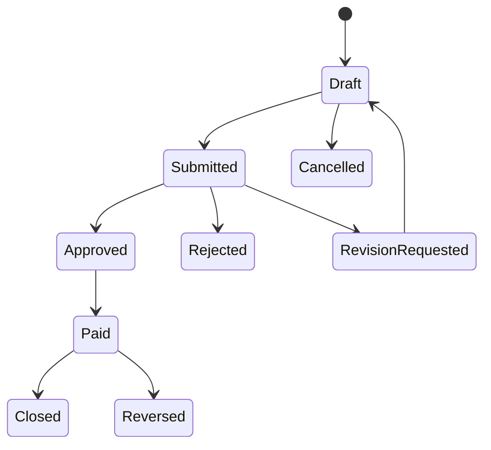

# State Machine: Payment Request

## Transition Rules

| From | To | Actor | Rule |
|---|---|---|---|
| Draft | Submitted | Requester | Required fields and attachment valid; `supplier_payment` wajib `supplier_id`, `non_stock_expense` wajib `expense_account_id` |
| Submitted | Approved | Approver | Within approval limit |
| Submitted | Rejected | Approver | Comment required |
| Approved | Paid | Finance | Bank account selected, period open |
| Paid | Reversed | Finance Manager | Reason and approval required |

## Source Type Rules

| Type | Required | Journal saat Paid |
|---|---|---|
| supplier_payment | `supplier_id` | Dr AP, Cr Bank |
| non_stock_expense | `expense_account_id` | Dr Expense, Cr Bank |
