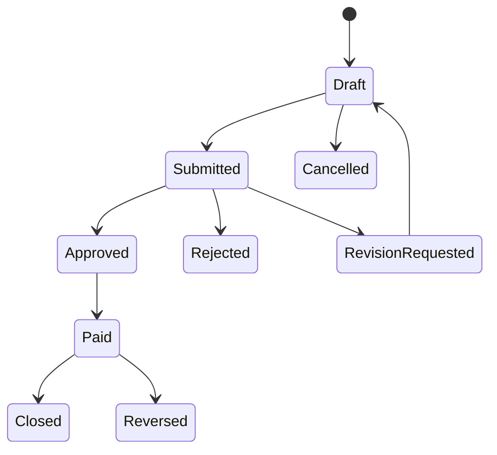

# State Machine: Payment Request

## Transition Rules

| From | To | Actor | Rule |
|---|---|---|---|
| Draft | Submitted | Requester | Required fields and attachment valid |
| Submitted | Approved | Approver | Within approval limit |
| Submitted | Rejected | Approver | Comment required |
| Approved | Paid | Finance | Bank account selected, period open |
| Paid | Reversed | Finance Manager | Reason and approval required |
