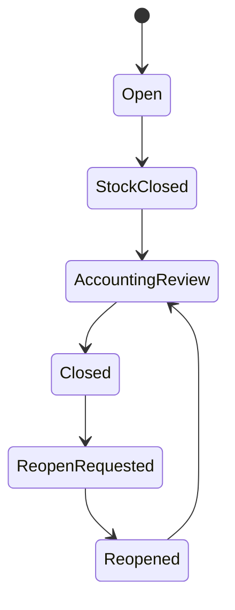

# State Machine: Period Closing

## Rules

1. Accounting cannot close before stock closed.
2. Closed period blocks transaction edits.
3. Reopen requires Owner approval and reason.
4. Reopen action must be logged.
