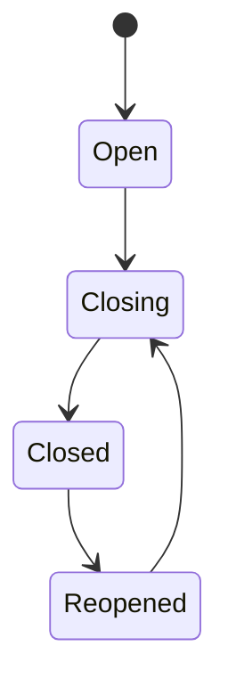

# State Machine: Period Reopen

## Transition Rules

| From | To | Actor | Rule |
|---|---|---|---|
| Open | Closing | Accounting | Closing checklist mulai dijalankan |
| Closing | Closed | Accounting | Semua item checklist selesai; snapshot dibuat |
| Closed | Reopened | Owner | Reason wajib; hanya Owner boleh approve reopen |
| Reopened | Closing | Accounting | Koreksi selesai, re-close periode |

## Guards

1. Closed period immutable: tidak ada write ke transaksi ber-tanggal dalam periode.
2. Reopen hanya oleh Owner (Accounting `request-only`).
3. Setiap reopen wajib `reopen_reason` dan masuk audit log.
4. Re-close menimpa `inventory_snapshots` dan `report_snapshots` periode tersebut.
5. Urutan close: stock dulu (Closing Stock) baru accounting (Closing Laporan).
