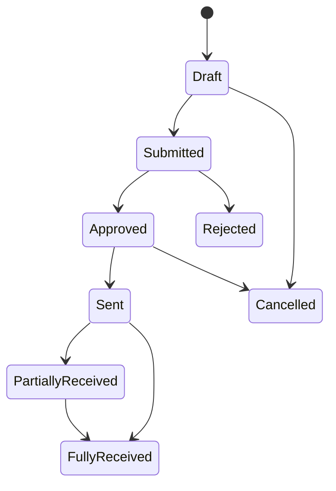

# State Machine: Purchase Order

## Rules

1. PO cannot be sent before approval.
2. Receiving quantity cannot exceed approved PO quantity without override approval.
3. Fully received PO is locked from edits.
4. Cancelled PO cannot be received.
