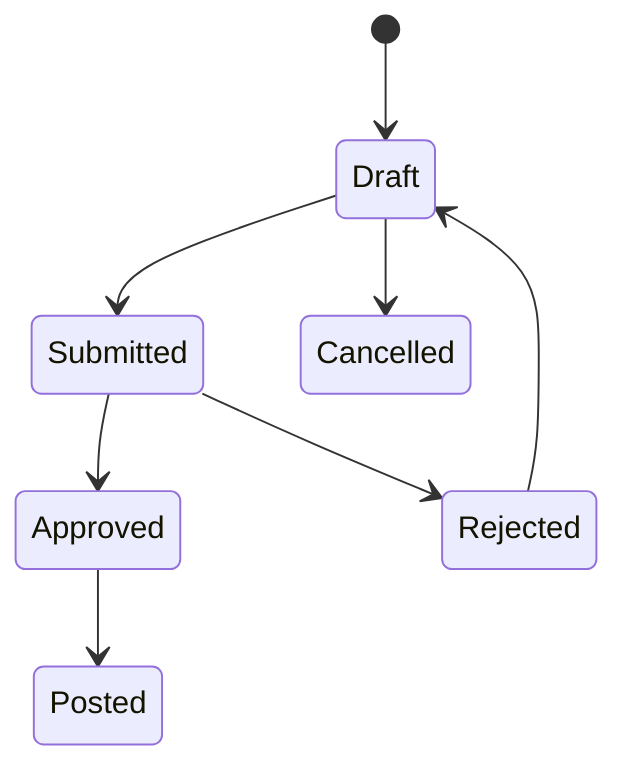

# State Machine: Stock Adjustment

## Transition Rules

| From | To | Actor | Rule |
|---|---|---|---|
| Draft | Submitted | Warehouse | Setiap line wajib punya alasan (rusak/hilang/sample/opname/lainnya) |
| Submitted | Approved | Finance Manager / Warehouse Manager | Dalam threshold; creator tidak boleh approve sendiri |
| Submitted | Rejected | Approver | Comment required |
| Approved | Posted | System | Period open; update stock_movements + journal |

## Guards

1. Creator ≠ approver (kecuali policy khusus).
2. Approval threshold mengikuti nominal adjustment.
3. Posting diblokir bila `movement_date` dalam closed period.
4. Adjustment yang sudah Posted immutable; koreksi lewat adjustment balik.

## Journal saat Posted

| Arah | Journal |
|---|---|
| adjustment_in | Dr Inventory, Cr Selisih Stock/Waste |
| adjustment_out | Dr Selisih Stock/Waste, Cr Inventory |
